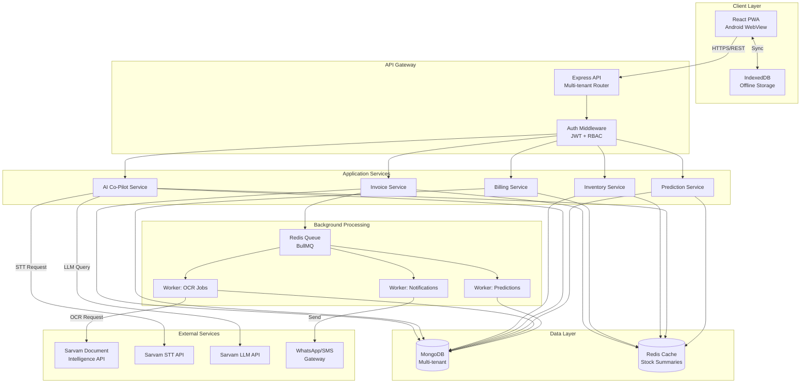
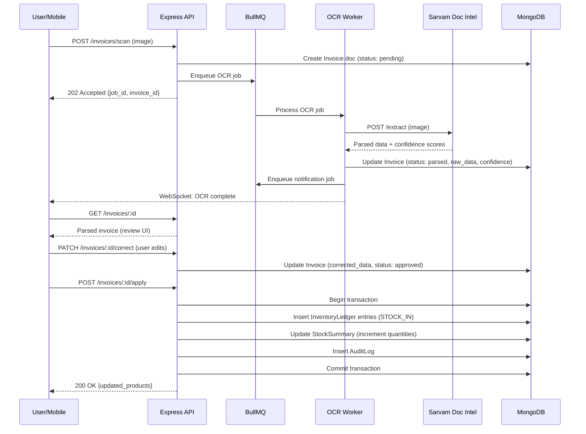
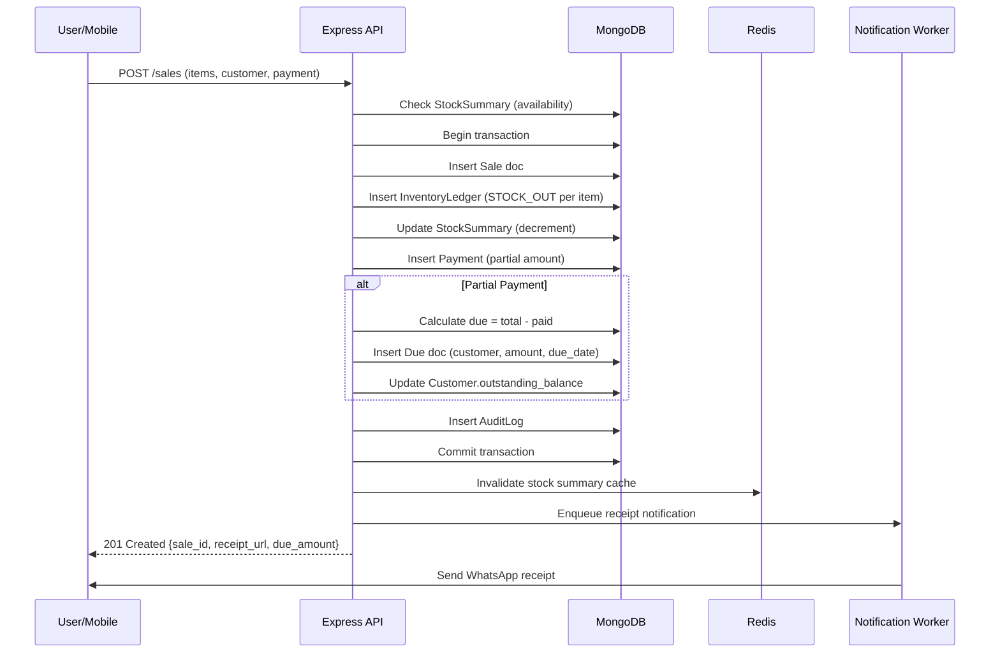
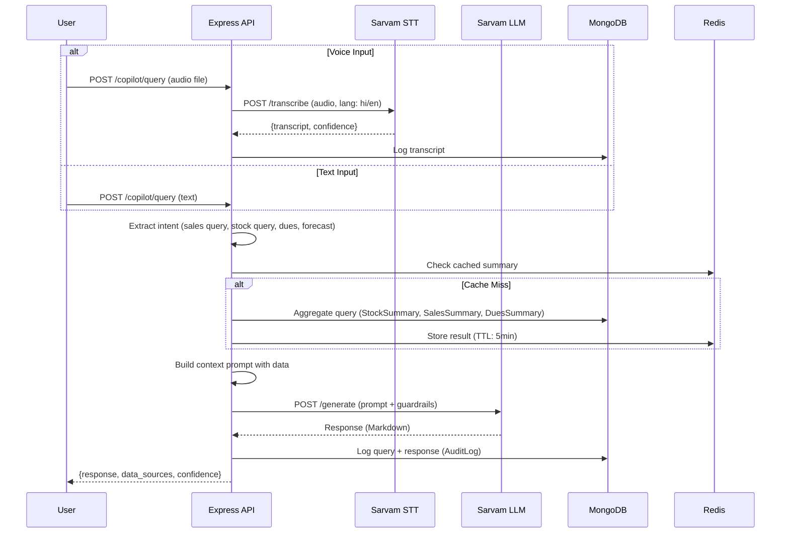

# Design Document: AI-Powered Smart Inventory System for SMB Retailers

## 1. Overview

This system provides SMB retailers with an AI-powered inventory and billing platform featuring invoice OCR, demand forecasting, credit risk scoring, and a conversational AI co-pilot. Built on MERN stack with Sarvam AI services, it uses a multi-tenant, offline-first architecture with a ledger-based inventory model for auditability and scalability. The system automates invoice processing, enables partial payment tracking, provides intelligent reorder suggestions, and allows retailers to query business metrics via voice or text in Hindi/English.

**Key Goals:**
- Reduce manual data entry by 80% through OCR
- Enable offline billing and inventory updates with seamless sync
- Provide AI-driven insights (forecasting, reorder, credit risk) with >75% accuracy
- Support 10,000+ SKUs per tenant with sub-3s query response times
- Ensure GST compliance and data localization

**MVP Scope:**
- **In:** Invoice OCR, billing with partial payments, inventory ledger, basic forecasting/reorder, credit scoring, AI co-pilot (text/voice), offline mode, single-store per tenant
- **Out:** Multi-store chains, e-commerce integration, advanced accounting, supplier portal, loyalty programs, custom hardware

## 2. Architecture

### High-Level Architecture



### Components

**Frontend: React PWA (Progressive Web App)**
- **Justification:** PWA provides offline-first capability, works on Android via WebView, single codebase for web/mobile, easier updates without app store approval, smaller bundle size than React Native
- **Tech:** React 18, React Query (server state), Zustand (client state), IndexedDB (offline storage), Workbox (service worker)
- **Offline:** Cache API responses, queue mutations, sync on reconnect

**Backend API: Node.js + Express**
- RESTful API with tenant isolation middleware
- JWT authentication with refresh tokens
- Rate limiting per tenant
- Request validation (Joi/Zod)
- Structured logging (Winston/Pino)

**MongoDB**
- Document database for flexible schema evolution
- Native multi-tenancy via tenant_id field
- Aggregation pipeline for analytics
- Change streams for real-time updates
- Sharding strategy: tenant_id as shard key

**Cache + Background Jobs: Redis + BullMQ**
- Redis: Cache stock summaries, session store, rate limit counters
- BullMQ: Async job processing (OCR, predictions, notifications)
- Job priorities, retries, dead letter queue
- Concurrency control per job type

**Worker Services**
- OCR Worker: Process invoice images via Sarvam Document Intelligence
- Prediction Worker: Run forecasting/reorder/credit risk models
- Notification Worker: Send WhatsApp/SMS/Email receipts and alerts

**Multi-Tenant Isolation Approach**
- **Database Level:** Every document includes `tenant_id` field
- **Middleware:** Extract tenant from JWT, inject into request context
- **Query Enforcement:** All DB queries auto-prepend `{ tenant_id: ctx.tenantId }`
- **Index Strategy:** Compound indexes start with tenant_id
- **Data Segregation:** No cross-tenant queries allowed
- **Resource Limits:** Per-tenant rate limits, storage quotas


## 3. Key Workflows

### Workflow 1: Invoice Scan → OCR → Inventory Update




### Workflow 2: Billing → Partial Payment → Due Creation



### Workflow 3: Offline Billing → Sync → Conflict Resolution

**Offline Mode:**
1. User creates sale in IndexedDB with `local_id` (UUID)
2. InventoryLedger entries stored locally with `synced: false`
3. StockSummary updated in local cache

**Sync Protocol:**
1. On reconnect, POST /sync/sales with batch of local sales
2. Server validates each sale (idempotency key = local_id)
3. Server checks for conflicts:
   - **Stock conflict:** Local stock-out exceeds server stock → reject with error
   - **Duplicate:** Sale with same local_id exists → return existing sale_id
   - **Success:** Apply sale, return server sale_id
4. Client updates local records with server IDs, marks synced
5. Client fetches server StockSummary to reconcile

**Conflict Resolution:**
- **Stock shortage:** Notify user, allow partial fulfillment or cancel
- **Price mismatch:** Use local price (user authority), log discrepancy
- **Customer credit limit exceeded:** Apply sale, flag for review
- **Ledger merge:** Server ledger is source of truth; local entries get server timestamps on sync


### Workflow 4: AI Co-Pilot Query (Voice/Text)



**Intent Examples:**
- "What were my sales yesterday?" → Query: SalesSummary (date range)
- "How much stock of Product X?" → Query: StockSummary (product filter)
- "Who owes me money?" → Query: DuesSummary (outstanding > 0)
- "Should I reorder Product Y?" → Query: PredictionSnapshot (reorder suggestions)


## 4. Data Model (MongoDB)

### Collections Overview

All collections include `tenant_id` as the first field for multi-tenant isolation.

### Tenant
```javascript
{
  _id: ObjectId,
  tenant_id: String, // same as _id for root tenant doc
  name: String,
  gstin: String,
  address: Object,
  subscription: {
    plan: String, // free, basic, premium
    valid_until: Date,
    max_skus: Number,
    max_users: Number
  },
  settings: {
    currency: String, // INR
    timezone: String, // Asia/Kolkata
    languages: [String], // [hi, en]
    low_stock_threshold: Number
  },
  created_at: Date,
  updated_at: Date
}
// Indexes: { _id: 1 }, { gstin: 1 }
```

### User
```javascript
{
  _id: ObjectId,
  tenant_id: String,
  email: String,
  phone: String,
  password_hash: String,
  name: String,
  role_id: ObjectId, // ref: Role
  is_active: Boolean,
  last_login: Date,
  created_at: Date
}
// Indexes: { tenant_id: 1, email: 1 }, { tenant_id: 1, phone: 1 }
```

### Role
```javascript
{
  _id: ObjectId,
  tenant_id: String,
  name: String, // owner, manager, cashier
  permissions: [String], // [invoice:read, invoice:write, sale:create, ...]
  created_at: Date
}
// Indexes: { tenant_id: 1, name: 1 }
```

### Product (SKU Master)
```javascript
{
  _id: ObjectId,
  tenant_id: String,
  sku: String, // tenant-scoped unique
  name: String,
  name_hi: String, // Hindi name
  category: String,
  subcategory: String,
  barcode: String,
  unit: String, // kg, ltr, pcs
  hsn_code: String, // GST HSN
  tax_rate: Number, // 5, 12, 18, 28
  mrp: Number,
  cost_price: Number,
  selling_price: Number,
  reorder_point: Number, // AI-updated
  reorder_quantity: Number, // AI-updated
  lead_time_days: Number,
  supplier_id: ObjectId, // ref: Supplier
  is_active: Boolean,
  created_at: Date,
  updated_at: Date
}
// Indexes: 
// { tenant_id: 1, sku: 1 } unique
// { tenant_id: 1, barcode: 1 }
// { tenant_id: 1, category: 1, is_active: 1 }
// { tenant_id: 1, name: "text", name_hi: "text" } // text search
```


### Supplier
```javascript
{
  _id: ObjectId,
  tenant_id: String,
  name: String,
  gstin: String,
  phone: String,
  email: String,
  address: Object,
  payment_terms: String, // Net 30, COD
  is_active: Boolean,
  created_at: Date
}
// Indexes: { tenant_id: 1, name: 1 }, { tenant_id: 1, gstin: 1 }
```

### Customer
```javascript
{
  _id: ObjectId,
  tenant_id: String,
  name: String,
  phone: String,
  email: String,
  address: Object,
  gstin: String, // optional for B2B
  credit_limit: Number, // AI-suggested, user-approved
  outstanding_balance: Number, // cached sum of dues
  credit_risk_score: Number, // 0-100, updated by AI
  credit_risk_category: String, // Low, Medium, High
  total_purchases: Number, // lifetime value
  last_purchase_date: Date,
  created_at: Date,
  updated_at: Date
}
// Indexes: 
// { tenant_id: 1, phone: 1 }
// { tenant_id: 1, outstanding_balance: 1 }
// { tenant_id: 1, credit_risk_category: 1 }
```

### Invoice (Supplier Invoice)
```javascript
{
  _id: ObjectId,
  tenant_id: String,
  invoice_number: String,
  supplier_id: ObjectId,
  invoice_date: Date,
  due_date: Date,
  status: String, // pending, parsed, corrected, approved, applied
  
  // Raw OCR data
  raw_image_url: String, // S3/storage
  raw_ocr_response: Object, // full Sarvam response
  ocr_confidence: Number, // 0-1
  
  // Parsed data (from OCR)
  parsed_data: {
    supplier_name: String,
    supplier_gstin: String,
    invoice_no: String,
    invoice_date: Date,
    line_items: [{
      description: String,
      hsn_code: String,
      quantity: Number,
      unit: String,
      rate: Number,
      tax_rate: Number,
      amount: Number
    }],
    subtotal: Number,
    tax_amount: Number,
    total: Number
  },
  
  // User-corrected data
  corrected_data: Object, // same schema as parsed_data
  correction_notes: String,
  
  // Mapped products
  mapped_products: [{
    product_id: ObjectId,
    quantity: Number,
    cost_price: Number
  }],
  
  applied_at: Date, // when inventory was updated
  applied_by: ObjectId, // user_id
  created_at: Date,
  updated_at: Date
}
// Indexes:
// { tenant_id: 1, invoice_number: 1, supplier_id: 1 }
// { tenant_id: 1, status: 1, created_at: -1 }
// { tenant_id: 1, supplier_id: 1, invoice_date: -1 }
```


### InventoryLedger (Append-Only)
```javascript
{
  _id: ObjectId,
  tenant_id: String,
  product_id: ObjectId,
  movement_type: String, // STOCK_IN, STOCK_OUT, ADJUSTMENT, RETURN
  quantity: Number, // positive for IN, negative for OUT
  unit_cost: Number, // for STOCK_IN
  reference_type: String, // invoice, sale, adjustment
  reference_id: ObjectId, // invoice_id or sale_id
  batch_number: String, // optional
  expiry_date: Date, // optional
  notes: String,
  created_by: ObjectId, // user_id
  created_at: Date, // immutable timestamp
  synced_from_offline: Boolean,
  local_id: String // for offline sync deduplication
}
// Indexes:
// { tenant_id: 1, product_id: 1, created_at: -1 }
// { tenant_id: 1, reference_type: 1, reference_id: 1 }
// { tenant_id: 1, created_at: -1 }
// { tenant_id: 1, local_id: 1 } // for sync dedup
```

**Why Ledger-Based Inventory:**
- **Auditability:** Complete history of every stock movement
- **Immutability:** No updates, only inserts (append-only)
- **Reconciliation:** Can rebuild stock at any point in time
- **Compliance:** GST audit trail requirements
- **Debugging:** Trace discrepancies to source transactions
- **Scalability:** Time-series data, can archive old entries

### StockSummary (Cached Derived View)
```javascript
{
  _id: ObjectId,
  tenant_id: String,
  product_id: ObjectId,
  quantity_on_hand: Number, // current stock
  quantity_reserved: Number, // for pending orders (future)
  quantity_available: Number, // on_hand - reserved
  last_stock_in: Date,
  last_stock_out: Date,
  last_cost: Number, // latest unit cost from ledger
  avg_cost: Number, // weighted average
  total_value: Number, // quantity * avg_cost
  updated_at: Date
}
// Indexes:
// { tenant_id: 1, product_id: 1 } unique
// { tenant_id: 1, quantity_on_hand: 1 }
// { tenant_id: 1, updated_at: -1 }
```

**How StockSummary is Computed:**
- **Initial:** Aggregate InventoryLedger on product_id, sum quantities
- **Incremental Update:** On each ledger insert, update corresponding summary doc
- **Rebuild:** Periodic job (daily) recalculates from ledger to fix drift
- **Cache:** Redis caches frequently accessed summaries (TTL: 5min)


### Sale (Bill)
```javascript
{
  _id: ObjectId,
  tenant_id: String,
  sale_number: String, // auto-generated
  customer_id: ObjectId, // null for walk-in
  sale_date: Date,
  
  line_items: [{
    product_id: ObjectId,
    sku: String,
    name: String,
    quantity: Number,
    unit_price: Number,
    tax_rate: Number,
    tax_amount: Number,
    line_total: Number
  }],
  
  subtotal: Number,
  tax_amount: Number,
  discount: Number,
  total: Number,
  
  payment_status: String, // paid, partial, unpaid
  amount_paid: Number,
  amount_due: Number,
  
  payment_mode: String, // cash, upi, card, credit
  
  notes: String,
  created_by: ObjectId, // user_id
  created_at: Date,
  
  // Offline sync
  synced_from_offline: Boolean,
  local_id: String, // UUID for idempotency
  offline_created_at: Date
}
// Indexes:
// { tenant_id: 1, sale_number: 1 } unique
// { tenant_id: 1, customer_id: 1, sale_date: -1 }
// { tenant_id: 1, sale_date: -1 }
// { tenant_id: 1, payment_status: 1 }
// { tenant_id: 1, local_id: 1 } // sync dedup
```

### Payment
```javascript
{
  _id: ObjectId,
  tenant_id: String,
  customer_id: ObjectId,
  sale_id: ObjectId, // null for advance payment
  amount: Number,
  payment_mode: String, // cash, upi, card, cheque
  payment_date: Date,
  reference_number: String, // UPI txn ID, cheque no
  notes: String,
  created_by: ObjectId,
  created_at: Date
}
// Indexes:
// { tenant_id: 1, customer_id: 1, payment_date: -1 }
// { tenant_id: 1, sale_id: 1 }
```

### Due
```javascript
{
  _id: ObjectId,
  tenant_id: String,
  customer_id: ObjectId,
  sale_id: ObjectId,
  amount: Number,
  due_date: Date,
  status: String, // pending, overdue, paid, written_off
  paid_amount: Number,
  balance: Number,
  overdue_days: Number, // computed
  reminder_sent_at: Date,
  paid_at: Date,
  created_at: Date,
  updated_at: Date
}
// Indexes:
// { tenant_id: 1, customer_id: 1, status: 1 }
// { tenant_id: 1, due_date: 1, status: 1 }
// { tenant_id: 1, status: 1, overdue_days: -1 }
```


### CreditProfile
```javascript
{
  _id: ObjectId,
  tenant_id: String,
  customer_id: ObjectId,
  
  // Payment behavior features
  total_purchases: Number,
  total_paid: Number,
  total_outstanding: Number,
  avg_payment_delay_days: Number,
  max_payment_delay_days: Number,
  on_time_payment_rate: Number, // 0-1
  default_count: Number, // payments >90 days overdue
  
  // Credit score
  credit_score: Number, // 0-100
  credit_category: String, // Low, Medium, High
  recommended_credit_limit: Number,
  
  // Metadata
  last_evaluated_at: Date,
  evaluation_count: Number,
  created_at: Date,
  updated_at: Date
}
// Indexes:
// { tenant_id: 1, customer_id: 1 } unique
// { tenant_id: 1, credit_category: 1 }
```

### PredictionSnapshot
```javascript
{
  _id: ObjectId,
  tenant_id: String,
  prediction_type: String, // forecast, reorder, credit_risk
  
  // For forecast/reorder
  product_id: ObjectId,
  forecast_period: String, // next_7_days, next_30_days
  predicted_demand: Number,
  confidence: Number, // 0-1
  reorder_point: Number,
  recommended_order_qty: Number,
  stockout_risk: String, // low, medium, high
  
  // For credit risk (redundant with CreditProfile, but snapshot)
  customer_id: ObjectId,
  credit_score: Number,
  
  // Model metadata
  model_version: String,
  features_used: [String],
  created_at: Date,
  valid_until: Date
}
// Indexes:
// { tenant_id: 1, product_id: 1, prediction_type: 1, created_at: -1 }
// { tenant_id: 1, customer_id: 1, prediction_type: 1, created_at: -1 }
// { tenant_id: 1, valid_until: 1 } // TTL index
```

### AIJob
```javascript
{
  _id: ObjectId,
  tenant_id: String,
  job_type: String, // ocr, stt, forecast, credit_scoring
  status: String, // queued, processing, completed, failed
  priority: Number, // 1-10
  
  // Input
  input_data: Object, // { image_url, audio_url, product_ids, ... }
  
  // Output
  output_data: Object, // parsed invoice, transcript, predictions
  error: String,
  
  // Metadata
  attempts: Number,
  max_attempts: Number,
  processing_time_ms: Number,
  created_by: ObjectId,
  created_at: Date,
  started_at: Date,
  completed_at: Date
}
// Indexes:
// { tenant_id: 1, job_type: 1, status: 1, created_at: -1 }
// { tenant_id: 1, status: 1, priority: -1 }
```


### AuditLog
```javascript
{
  _id: ObjectId,
  tenant_id: String,
  user_id: ObjectId,
  action: String, // invoice_created, sale_created, stock_adjusted, ...
  resource_type: String, // invoice, sale, product, customer
  resource_id: ObjectId,
  changes: Object, // before/after for updates
  ip_address: String,
  user_agent: String,
  created_at: Date
}
// Indexes:
// { tenant_id: 1, created_at: -1 }
// { tenant_id: 1, user_id: 1, created_at: -1 }
// { tenant_id: 1, resource_type: 1, resource_id: 1, created_at: -1 }
// TTL index: { created_at: 1 } expireAfterSeconds: 31536000 (1 year)
```

### Relationships

**Reference vs Embed:**
- **Reference (ObjectId):** User, Product, Customer, Supplier, Sale, Invoice
  - Rationale: These are master entities, frequently updated independently, need normalization
- **Embed:** Sale.line_items, Invoice.parsed_data, Payment details
  - Rationale: Immutable snapshots, always accessed with parent, avoid joins

**Denormalization Strategy:**
- Sale.line_items embed product name/sku (snapshot at sale time)
- Customer.outstanding_balance cached (updated on payment/due changes)
- StockSummary is fully denormalized from InventoryLedger

## 5. API Design (REST)

### Authentication
- `POST /auth/register` - Register new tenant + owner user
- `POST /auth/login` - Login (email/phone + password) → JWT + refresh token
- `POST /auth/refresh` - Refresh access token
- `POST /auth/logout` - Invalidate refresh token

### Products
- `GET /products` - List products (pagination, filters, search)
- `POST /products` - Create product
- `GET /products/:id` - Get product details
- `PATCH /products/:id` - Update product
- `DELETE /products/:id` - Soft delete product
- `GET /products/:id/stock` - Get stock summary + recent movements

### Invoices (Supplier)
- `POST /invoices/scan` - Upload invoice image → enqueue OCR job → 202 Accepted {job_id, invoice_id}
- `GET /invoices/:id` - Get invoice (raw, parsed, corrected data)
- `PATCH /invoices/:id/correct` - Submit user corrections
- `POST /invoices/:id/apply` - Apply to inventory (create ledger entries)
- `GET /invoices` - List invoices (filters: status, supplier, date range)

**Idempotency:** Use `Idempotency-Key` header (UUID). Server stores key → invoice_id mapping for 24h. Duplicate requests return existing invoice.


### Sales (Billing)
- `POST /sales` - Create sale (items, customer, payment) → 201 {sale_id, receipt_url, due_amount}
  - Request: `{ customer_id?, line_items: [{product_id, quantity, unit_price}], payment: {mode, amount}, notes? }`
  - Response: `{ sale_id, sale_number, total, amount_paid, amount_due, receipt_url }`
- `GET /sales/:id` - Get sale details
- `GET /sales` - List sales (filters: date, customer, payment_status)
- `POST /sales/:id/return` - Process return (create reverse ledger entries)

**Idempotency:** Use `local_id` field (UUID from offline client). Server checks for existing sale with same local_id before creating.

### Payments & Dues
- `POST /payments` - Record payment (customer_id, sale_id?, amount, mode)
- `GET /payments` - List payments (filters: customer, date)
- `GET /dues` - List outstanding dues (filters: customer, overdue)
- `GET /dues/summary` - Aggregate dues by customer, aging buckets
- `POST /dues/:id/remind` - Send payment reminder

### Customers
- `GET /customers` - List customers (search, filters)
- `POST /customers` - Create customer
- `GET /customers/:id` - Get customer details + credit profile
- `PATCH /customers/:id` - Update customer
- `GET /customers/:id/transactions` - Sales + payments history
- `GET /customers/:id/credit-profile` - Credit score, risk category, recommended limit

### Suppliers
- `GET /suppliers` - List suppliers
- `POST /suppliers` - Create supplier
- `GET /suppliers/:id` - Get supplier details
- `PATCH /suppliers/:id` - Update supplier

### Inventory
- `GET /inventory/summary` - Stock summary for all products (filters, pagination)
- `GET /inventory/movements` - Ledger entries (filters: product, date, type)
- `POST /inventory/adjust` - Manual stock adjustment (create ADJUSTMENT ledger entry)
- `GET /inventory/low-stock` - Products below reorder point
- `GET /inventory/valuation` - Total inventory value

### Dashboard & Analytics
- `GET /dashboard/summary` - Today's sales, stock value, outstanding dues, low stock count
- `GET /analytics/sales` - Sales trends (daily/weekly/monthly aggregates)
- `GET /analytics/top-products` - Best sellers by revenue/quantity
- `GET /analytics/profit-margins` - Profit analysis by product/category
- `GET /analytics/customer-segments` - Customer segmentation (high-value, at-risk, etc.)


### AI Endpoints
- `POST /ai/ocr/start` - Start OCR job (invoice image) → 202 {job_id}
- `GET /ai/jobs/:id` - Get job status + result
- `POST /ai/stt/transcribe` - Transcribe audio → {transcript, confidence}
- `POST /ai/copilot/query` - Ask business question (text or audio) → {response, data_sources}
- `GET /ai/predictions/forecast` - Get demand forecasts (filters: product, period)
- `GET /ai/predictions/reorder` - Get reorder suggestions (sorted by priority)
- `POST /ai/predictions/refresh` - Trigger prediction refresh (async job)
- `GET /ai/credit-scores` - Get credit risk scores for customers

### Sync (Offline)
- `POST /sync/sales` - Batch sync offline sales
  - Request: `{ sales: [{local_id, customer_id, line_items, payment, offline_created_at}] }`
  - Response: `{ results: [{local_id, sale_id?, status: success|conflict|error, error?}] }`
- `POST /sync/inventory` - Batch sync offline ledger entries
- `GET /sync/pull` - Pull server changes since last sync (timestamp-based)

**Idempotency Strategy:**
- All mutation endpoints accept `Idempotency-Key` header (UUID)
- Server stores key → resource_id mapping in Redis (TTL: 24h)
- Duplicate requests return cached response (200 OK with existing resource)
- Offline sync uses `local_id` field as natural idempotency key

## 6. AI Features Design

### A) Invoice OCR & Document Intelligence (Sarvam Document Intelligence)

**Input Formats:**
- Image: JPEG, PNG (max 10MB)
- PDF: Single-page invoices (multi-page future)
- Resolution: Min 300 DPI recommended

**Preprocessing (Client-side):**
- Auto-rotate based on EXIF
- Compress to <2MB if needed (quality: 85%)
- Crop borders (optional, user-guided)

**Sarvam API Integration:**
```
POST https://api.sarvam.ai/document-intelligence/extract
Headers:
  Authorization: Bearer <API_KEY>
  Content-Type: multipart/form-data
Body:
  file: <image>
  document_type: invoice
  language: hi,en
```

**Extraction Output Schema:**
```javascript
{
  vendor: {
    name: String,
    gstin: String,
    address: String,
    phone: String
  },
  invoice_metadata: {
    invoice_number: String,
    invoice_date: Date,
    due_date: Date
  },
  line_items: [{
    description: String,
    hsn_code: String,
    quantity: Number,
    unit: String,
    rate: Number,
    tax_rate: Number,
    amount: Number,
    confidence: Number // per field
  }],
  totals: {
    subtotal: Number,
    cgst: Number,
    sgst: Number,
    igst: Number,
    total: Number
  },
  overall_confidence: Number // 0-1
}
```


**Confidence Scoring & Validation:**
- **High confidence (>0.9):** Auto-approve fields, highlight for quick review
- **Medium confidence (0.7-0.9):** Flag for user review, suggest corrections
- **Low confidence (<0.7):** Require manual entry/correction

**Validation Rules:**
- GSTIN format: 15 chars, checksum validation
- Invoice date <= today
- Line item amounts sum to subtotal (±1% tolerance)
- Tax calculations match declared rates
- Total = subtotal + taxes (±1% tolerance)

**Human-in-Loop Correction UX:**
1. Display parsed invoice side-by-side with original image
2. Highlight low-confidence fields in yellow
3. Allow inline editing with autocomplete (supplier names, products)
4. Show confidence scores on hover
5. "Approve All" or "Correct & Approve" actions
6. Store both parsed and corrected versions

**Storage:**
- Raw image: S3/Cloud Storage (tenant_id/invoices/{invoice_id}.jpg)
- Raw OCR response: Invoice.raw_ocr_response (full JSON)
- Parsed data: Invoice.parsed_data
- Corrected data: Invoice.corrected_data (only if user edits)
- Version history: AuditLog tracks all corrections

**Retry, Timeout, Failure:**
- **Timeout:** 30s per request
- **Retry:** 3 attempts with exponential backoff (2s, 4s, 8s)
- **Failure states:**
  - OCR service down → Job status: failed, allow manual entry
  - Low confidence on all fields → Prompt user to retake photo or enter manually
  - Invalid image format → Immediate error, no job created
- **Fallback:** Always allow manual invoice entry (skip OCR)

**Cost/Latency Estimate:**
- Sarvam pricing: ~₹2-5 per invoice (assumed)
- Latency: 5-15s per invoice (network + processing)
- **Batching strategy:** Process invoices sequentially (no batching in MVP), queue with BullMQ for rate limiting

### B) Speech-to-Text (Sarvam STT)

**API Modes:**
- **REST (Synchronous):** For short queries (<30s audio), real-time response
- **Batch (Asynchronous):** For long recordings (future), not needed for co-pilot

**MVP: Use REST mode only**

**Sarvam STT API:**
```
POST https://api.sarvam.ai/speech-to-text
Headers:
  Authorization: Bearer <API_KEY>
  Content-Type: multipart/form-data
Body:
  file: <audio> (WAV, MP3, OGG)
  language: hi-IN | en-IN
  model: saarika-v1 (Hindi) | saaras-v1 (English)
  enable_punctuation: true
  enable_inverse_text_normalization: true
```

**Response:**
```javascript
{
  transcript: String,
  language: String,
  confidence: Number,
  words: [{
    word: String,
    start_time: Number,
    end_time: Number,
    confidence: Number
  }]
}
```


**Languages:**
- Hindi (hi-IN): Use Saarika model
- English (en-IN): Use Saaras model
- Auto-detect: Try Hindi first (primary user base), fallback to English if confidence <0.5

**Post-Processing: Transcript → Structured Commands**

For co-pilot queries, extract intent and entities:

**Example Transcript:** "कल की बिक्री कितनी थी?" (What were yesterday's sales?)

**Post-processing:**
1. Language detection (Hindi)
2. Intent classification: `sales_query`
3. Entity extraction: `date: yesterday`
4. Structured output:
```javascript
{
  intent: "sales_query",
  entities: {
    date_range: { start: "2026-02-08", end: "2026-02-08" }
  },
  confidence: 0.92
}
```

**Intent Categories:**
- `sales_query`: Revenue, transaction count, top products
- `stock_query`: Current stock, low stock, product availability
- `dues_query`: Outstanding dues, overdue customers
- `forecast_query`: Demand predictions, reorder suggestions
- `customer_query`: Customer details, purchase history
- `general`: Fallback to LLM

**Entity Extraction (Regex + NLP):**
- Dates: "कल" (yesterday), "आज" (today), "पिछले हफ्ते" (last week)
- Products: Match against product names (fuzzy search)
- Customers: Match against customer names/phone
- Amounts: "₹1000", "एक हजार रुपये"

**Error Handling:**
- **Low confidence (<0.6):** Ask user to repeat or type
- **No intent match:** Pass full transcript to LLM for interpretation
- **Network failure:** Fallback to text input, show error message

**Storage:**
- Store transcript in AuditLog with query response
- Store extracted intent JSON for analytics

**Cost/Latency:**
- Sarvam STT: ~₹0.5-1 per minute (assumed)
- Latency: 2-5s for 10s audio
- Audio format: Compress to OGG Opus (16kHz, mono) before upload

### C) Predictions & Decision Intelligence

**Technique: Hybrid Rules + Lightweight Forecasting**

**1. Demand Forecasting**

**Method:** Exponential Smoothing (Holt-Winters for seasonality)

**Features:**
- Historical sales (daily, last 90 days)
- Day of week (weekday vs weekend)
- Seasonality tags (festival, month-end, payday)
- Trend (growing, stable, declining)
- External events (manually tagged: Diwali, Holi, etc.)

**Algorithm:**
```
Level: L(t) = α * Sales(t) + (1-α) * L(t-1)
Trend: T(t) = β * (L(t) - L(t-1)) + (1-β) * T(t-1)
Seasonal: S(t) = γ * (Sales(t) - L(t)) + (1-γ) * S(t-m)
Forecast: F(t+h) = L(t) + h*T(t) + S(t+h-m)
```

**Parameters:** α=0.3, β=0.1, γ=0.2, m=7 (weekly seasonality)


**Output Contract:**
```javascript
{
  product_id: ObjectId,
  forecast_period: "next_7_days",
  predicted_demand: 150, // units
  confidence: 0.82, // based on historical variance
  lower_bound: 120,
  upper_bound: 180,
  trend: "growing", // growing, stable, declining
  seasonality_factor: 1.2, // upcoming period vs baseline
  created_at: Date,
  valid_until: Date // forecast expires after 7 days
}
```

**2. Reorder Suggestions**

**Method:** Reorder Point = (Avg Daily Sales * Lead Time) + Safety Stock

**Features:**
- Current stock (from StockSummary)
- Avg daily sales (last 30 days)
- Lead time (Product.lead_time_days)
- Sales velocity trend
- Forecast for next lead_time period
- Stockout risk score

**Algorithm:**
```
Avg_Daily_Sales = Sum(Sales_Last_30_Days) / 30
Safety_Stock = Z_Score * StdDev(Daily_Sales) * sqrt(Lead_Time)
Reorder_Point = (Avg_Daily_Sales * Lead_Time) + Safety_Stock
Recommended_Order_Qty = EOQ or (Avg_Daily_Sales * Order_Cycle_Days)

If Current_Stock <= Reorder_Point:
  Suggest reorder with priority based on stockout_risk
```

**Output Contract:**
```javascript
{
  product_id: ObjectId,
  current_stock: 50,
  reorder_point: 80,
  recommended_order_qty: 200,
  stockout_risk: "high", // high, medium, low
  days_until_stockout: 3, // estimated
  priority: 1, // 1=urgent, 2=soon, 3=monitor
  reason: "Stock below reorder point, high sales velocity",
  created_at: Date
}
```

**3. Credit Risk Scoring**

**Method:** Rule-based scoring + logistic regression (future ML)

**Features (from CreditProfile + Payment history):**
- `on_time_payment_rate`: % of payments made on/before due date
- `avg_payment_delay_days`: Average delay across all payments
- `max_payment_delay_days`: Worst delay ever
- `default_count`: Payments >90 days overdue
- `total_purchases`: Lifetime purchase value
- `purchase_frequency`: Transactions per month
- `current_outstanding_ratio`: Outstanding / Total purchases
- `account_age_days`: Days since first purchase

**Scoring Formula (Rule-based MVP):**
```
Base_Score = 50

// Positive factors
+ (on_time_payment_rate * 30)
+ min(account_age_days / 10, 10) // max 10 points
+ min(purchase_frequency * 2, 10) // max 10 points

// Negative factors
- (avg_payment_delay_days * 0.5)
- (default_count * 10)
- (current_outstanding_ratio * 20)

Credit_Score = clamp(Base_Score, 0, 100)
```

**Risk Category:**
- 80-100: Low Risk
- 50-79: Medium Risk
- 0-49: High Risk

**Recommended Credit Limit:**
```
If Low Risk: Avg_Monthly_Purchase * 2
If Medium Risk: Avg_Monthly_Purchase * 1
If High Risk: Avg_Monthly_Purchase * 0.5 or ₹0
```


**Output Contract:**
```javascript
{
  customer_id: ObjectId,
  credit_score: 72,
  credit_category: "Medium",
  recommended_credit_limit: 50000,
  risk_factors: [
    "Average payment delay: 15 days",
    "1 payment overdue >60 days"
  ],
  positive_factors: [
    "85% on-time payment rate",
    "Regular customer for 6 months"
  ],
  last_evaluated_at: Date
}
```

**Evaluation Metrics:**

**Forecast MAPE (Mean Absolute Percentage Error):**
```
MAPE = (1/n) * Σ |Actual - Forecast| / Actual * 100
Target: <25% for top 20% products
```

**Stockout Replay Simulation:**
- Replay last 90 days with reorder suggestions
- Measure: % reduction in stockout days
- Target: 50% reduction

**Credit Risk AUC:**
- Label: Customer defaulted (>90 days overdue) = 1, else 0
- Compute ROC curve, measure AUC
- Target: >0.80

**Cold Start Strategy:**
- **New Products:** Use category average sales for first 30 days
- **New Customers:** Default credit score = 60 (Medium), limit = ₹10,000
- **Insufficient Data:** Show "Insufficient data for prediction" message

**Update Frequency:**
- Forecasts: Daily at 2 AM
- Reorder suggestions: Daily at 2 AM
- Credit scores: Weekly on Sundays, or on-demand after payment

### D) AI Business Co-Pilot (LLM Layer)

**Guardrails:**
- LLM provides explanations, insights, recommendations
- **All numbers come from DB summaries** (no LLM-generated figures)
- LLM cannot execute actions (read-only)
- Responses must cite data sources

**Context Sources:**
1. **StockSummary:** Current inventory levels
2. **SalesSummary:** Aggregated sales by day/week/month
3. **DuesSummary:** Outstanding dues by customer, aging
4. **PredictionSnapshot:** Forecasts, reorder suggestions, credit scores
5. **Customer/Product metadata:** Names, categories, etc.

**Prompt Strategy:**

**System Prompt:**
```
You are a business assistant for a retail store in India. Answer questions about sales, inventory, customers, and finances based ONLY on the provided data. Never make up numbers. Always cite your data source. Respond in the user's language (Hindi or English). Be concise and actionable.

Rules:
1. Use only the data provided in the context
2. If data is missing, say "I don't have that information"
3. Format numbers in Indian style (₹1,00,000)
4. Provide actionable insights when relevant
5. Keep responses under 200 words
```


**User Prompt Template:**
```
User Question: {user_query}

Context Data:
{context_json}

Instructions: Answer the user's question using only the context data. Cite sources.
```

**Example:**

**User Query:** "What were my sales yesterday?"

**Context Data:**
```json
{
  "sales_summary": {
    "date": "2026-02-08",
    "total_revenue": 45000,
    "transaction_count": 32,
    "top_product": "Tata Salt 1kg"
  }
}
```

**LLM Response:**
```
Yesterday (Feb 8), your store made ₹45,000 in revenue from 32 transactions. Your top-selling product was Tata Salt 1kg.

Source: Sales Summary for 2026-02-08
```

**Response Format:**
- Plain text or Markdown
- Include data source citation at end
- Highlight actionable items (e.g., "Consider restocking Product X")

**Logging & Auditability:**
- Log every query + response in AuditLog
- Store context data used (for debugging)
- Track response time, LLM tokens used
- Flag queries that couldn't be answered (missing data)

**Safety:**
- No PII in LLM prompts (use IDs, not names/phones)
- Rate limit: 10 queries/minute per user
- Content filter: Block non-business queries
- Fallback: If LLM fails, return raw data with "Unable to generate summary"

**Sarvam LLM API:**
```
POST https://api.sarvam.ai/chat/completions
Headers:
  Authorization: Bearer <API_KEY>
  Content-Type: application/json
Body:
  {
    "model": "sarvam-2b",
    "messages": [
      {"role": "system", "content": "<system_prompt>"},
      {"role": "user", "content": "<user_prompt>"}
    ],
    "temperature": 0.3,
    "max_tokens": 300
  }
```

## 7. Offline-First & Sync Strategy

### What Works Offline

**Fully Offline:**
- View products, customers, stock summary (cached)
- Create sales/bills
- Record payments
- View recent transactions (cached)
- Search products by name/barcode

**Requires Online:**
- Invoice OCR (image upload + processing)
- AI co-pilot queries (STT + LLM)
- Sync to server
- View real-time analytics
- Predictions refresh

### Local Storage Approach

**Technology:** IndexedDB (via Dexie.js)

**Stores:**
- `products`: Full product catalog (synced daily)
- `customers`: Customer list (synced daily)
- `stock_summary`: Cached stock levels (synced on app open)
- `sales_queue`: Pending sales to sync
- `ledger_queue`: Pending inventory movements
- `sync_metadata`: Last sync timestamp per entity


### Sync Protocol

**Pull (Server → Client):**
1. Client sends last sync timestamp
2. Server returns all changes since timestamp (products, customers, stock)
3. Client merges changes into IndexedDB
4. Client updates sync timestamp

**Push (Client → Server):**
1. Client sends queued sales/ledger entries with `local_id` (UUID)
2. Server validates and applies each entry
3. Server returns results: `{local_id, server_id, status}`
4. Client updates local records with server IDs, removes from queue

**Sync Triggers:**
- On app open (if online)
- Every 5 minutes (background sync, if online)
- Manual "Sync Now" button
- After creating sale (immediate push attempt)

**Retries:**
- Exponential backoff: 5s, 10s, 30s, 1min, 5min
- Max retries: 10
- Persistent queue (survives app restart)

**Deduplication:**
- Use `local_id` (UUID) as idempotency key
- Server checks for existing record with same `local_id` before creating
- If exists, return existing `server_id` (no error)

### Conflict Resolution

**Conflict Types:**

**1. Stock Conflict:**
- **Scenario:** Offline sale reduces stock, but server stock already depleted
- **Resolution:** 
  - Server rejects sale with error: `insufficient_stock`
  - Client shows error, allows user to adjust quantity or cancel
  - User can override (create negative stock) with warning

**2. Price Conflict:**
- **Scenario:** Product price changed on server while offline sale used old price
- **Resolution:**
  - Accept offline price (user authority at point of sale)
  - Log discrepancy in AuditLog for review
  - Show warning on next sync

**3. Customer Credit Limit Conflict:**
- **Scenario:** Offline sale exceeds updated credit limit
- **Resolution:**
  - Apply sale (transaction already completed)
  - Flag customer account for review
  - Notify user on next sync

**4. Duplicate Sale:**
- **Scenario:** Same `local_id` synced twice (network retry)
- **Resolution:**
  - Server returns existing `sale_id`, status: `duplicate`
  - Client marks as synced, no error

### Event Sourcing / Ledger Merge

**Principle:** Server ledger is source of truth

**Merge Strategy:**
1. Client sends ledger entries with `local_id` + `offline_created_at`
2. Server inserts entries with server `created_at` (current time)
3. Server rebuilds StockSummary from full ledger (including new entries)
4. Client fetches updated StockSummary, replaces local cache
5. Client marks ledger entries as synced

**Ledger Immutability:**
- Once synced, ledger entries are never modified
- Corrections create new ADJUSTMENT entries
- Full audit trail preserved

## 8. Security, Privacy, Compliance

### RBAC (Role-Based Access Control)

**Roles:**
- **Owner:** Full access (all permissions)
- **Manager:** Sales, inventory, reports (no user management, no settings)
- **Cashier:** Sales, view products (no inventory adjustments, no reports)

**Permissions (examples):**
- `product:read`, `product:write`, `product:delete`
- `sale:create`, `sale:read`, `sale:refund`
- `invoice:scan`, `invoice:approve`
- `customer:read`, `customer:write`
- `report:view`, `settings:manage`, `user:manage`

**Enforcement:**
- Middleware checks `user.role.permissions` before allowing action
- Frontend hides UI elements based on permissions
- API returns 403 Forbidden if permission missing


### Tenant Isolation

**Database Level:**
- Every query includes `{ tenant_id: ctx.tenantId }`
- Compound indexes start with `tenant_id`
- No cross-tenant queries allowed (enforced by middleware)

**Middleware:**
```javascript
async function tenantMiddleware(req, res, next) {
  const token = req.headers.authorization;
  const decoded = jwt.verify(token, SECRET);
  req.tenantId = decoded.tenant_id;
  req.userId = decoded.user_id;
  
  // Inject tenant filter into all DB queries
  req.dbFilter = { tenant_id: req.tenantId };
  next();
}
```

**Testing:**
- Unit tests verify tenant_id in all queries
- Integration tests with multiple tenants ensure no leakage

### Encryption

**At Rest:**
- MongoDB: Enable encryption at rest (cloud provider feature)
- Sensitive fields (password_hash): Bcrypt with salt rounds=12
- API keys: Encrypted with AES-256 before storing

**In Transit:**
- HTTPS only (TLS 1.3)
- Certificate pinning for mobile app
- Secure WebSocket (WSS) for real-time updates

### Data Localization (India)

**Compliance:** RBI data localization norms, DPDP Act 2023

**Strategy:**
- Host all data in India region (AWS ap-south-1, GCP asia-south1)
- No cross-border data transfer
- Backup storage also in India
- Sarvam AI (Indian company) ensures data stays in India

### Audit Trails

**AuditLog Collection:**
- Log all mutations (create, update, delete)
- Include user_id, IP, timestamp, before/after state
- Retention: 1 year (TTL index)
- Immutable (append-only)

**Use Cases:**
- Compliance audits (GST, tax)
- Dispute resolution (customer claims)
- Fraud detection (unusual patterns)
- Debugging (trace data changes)

### PII Handling

**Customer Data:**
- Name, phone, email, address are PII
- Encrypt phone/email in DB (optional, future)
- Mask in logs (show last 4 digits only)
- GDPR-like rights: Export, delete (soft delete with anonymization)

**Data Retention:**
- Active customers: Indefinite
- Inactive customers (no transaction >2 years): Anonymize PII, keep transaction history
- User requests deletion: Anonymize within 30 days

### Rate Limiting

**Per Tenant:**
- API: 1000 requests/hour
- OCR jobs: 100/day
- STT queries: 500/day
- LLM queries: 200/day

**Per User:**
- Login attempts: 5/15min (lockout after)
- Password reset: 3/hour

**Implementation:** Redis with sliding window counters

### Secrets Management

**Environment Variables:**
- MongoDB URI, Redis URI
- JWT secret, refresh token secret
- Sarvam API keys
- WhatsApp/SMS gateway credentials

**Storage:**
- Dev: `.env` file (gitignored)
- Prod: AWS Secrets Manager / GCP Secret Manager
- Rotation: API keys rotated every 90 days


## 9. Scalability & Observability

### Expected Scale

**Per Tenant:**
- 10,000 SKUs (products)
- 1,000 customers
- 100 sales/day (3,000/month)
- 50 invoice scans/month
- 5 concurrent users (peak)

**System-wide (1 year):**
- 1,000 tenants
- 10M products (across tenants)
- 100K sales/day
- 1,500 OCR jobs/day

### Performance Targets

**API Latency (P95):**
- Read queries: <200ms
- Write queries: <500ms
- Search: <300ms
- Analytics aggregations: <2s

**Job Throughput:**
- OCR: 10 concurrent jobs, 15s avg processing time → 40 jobs/min
- Predictions: 100 tenants/hour (daily batch)
- Notifications: 1000/min

**Database:**
- MongoDB: Sharded by tenant_id (when >1TB data)
- Indexes: Cover all common queries
- Connection pool: 100 connections

**Cache Hit Rate:**
- Stock summaries: >80%
- Product catalog: >90%
- Session data: >95%

### Logging

**Structured Logging (JSON):**
```javascript
{
  timestamp: "2026-02-09T10:30:00Z",
  level: "info",
  service: "api",
  tenant_id: "tenant_123",
  user_id: "user_456",
  request_id: "req_789",
  method: "POST",
  path: "/sales",
  status: 201,
  duration_ms: 145,
  message: "Sale created"
}
```

**Log Levels:**
- ERROR: Failures, exceptions
- WARN: Retries, degraded performance
- INFO: Business events (sale created, invoice scanned)
- DEBUG: Detailed flow (dev only)

**Storage:**
- CloudWatch Logs / GCP Logging
- Retention: 30 days
- Alerts on ERROR spike

### Metrics

**Application Metrics (Prometheus):**
- Request rate, latency (per endpoint)
- Error rate (4xx, 5xx)
- Active users (concurrent)
- Queue depth (BullMQ)
- Job processing time (OCR, predictions)

**Business Metrics:**
- Sales created/hour
- Invoices scanned/day
- AI queries/day
- Sync success rate

**Infrastructure Metrics:**
- CPU, memory, disk usage
- MongoDB query time
- Redis hit rate
- Network I/O

**Dashboards:** Grafana with real-time charts

### Tracing

**Distributed Tracing (OpenTelemetry):**
- Trace request flow: API → Service → DB → External API
- Identify bottlenecks (slow queries, API calls)
- Correlate logs with traces (request_id)

**Example Trace:**
```
POST /sales [200ms]
  ├─ Check stock [20ms]
  │  └─ MongoDB query [15ms]
  ├─ Create sale [50ms]
  │  └─ MongoDB insert [40ms]
  ├─ Update stock summary [30ms]
  └─ Enqueue notification [10ms]
```


### Monitoring & Alerts

**What to Monitor:**
- API error rate >5% (5min window) → Alert
- P95 latency >1s → Alert
- OCR job failure rate >10% → Alert
- Queue depth >1000 → Alert
- MongoDB replica lag >10s → Alert
- Disk usage >80% → Alert
- Sync failure rate >20% → Alert

**Alerting Channels:**
- PagerDuty (critical)
- Slack (warnings)
- Email (daily summary)

### Failure Modes & Resilience

**Failure Scenarios:**

**1. MongoDB Down:**
- Impact: All writes fail, reads fail
- Mitigation: MongoDB replica set (3 nodes), auto-failover
- Fallback: Return 503 Service Unavailable, retry with backoff

**2. Redis Down:**
- Impact: Cache misses, queue stops
- Mitigation: Redis Sentinel (HA), fallback to DB for reads
- Fallback: Degrade gracefully (slower, but functional)

**3. Sarvam API Down:**
- Impact: OCR/STT/LLM fail
- Mitigation: Retry with backoff, queue jobs for later
- Fallback: Manual entry for invoices, text-only for co-pilot

**4. Network Partition (Client):**
- Impact: Sync fails
- Mitigation: Offline mode, queue mutations
- Fallback: Sync when reconnected

**5. High Load (Traffic Spike):**
- Impact: Slow responses, timeouts
- Mitigation: Auto-scaling (horizontal), rate limiting
- Fallback: Queue non-critical jobs, prioritize sales

**Circuit Breaker:**
- Wrap external API calls (Sarvam) with circuit breaker
- Open circuit after 5 consecutive failures
- Half-open after 30s, retry
- Prevents cascading failures

**Graceful Degradation:**
- If predictions unavailable, show cached results
- If co-pilot fails, return raw data
- If notifications fail, log and retry later

## 10. Deployment

### Environments

**Development:**
- Local MongoDB, Redis
- Mock Sarvam APIs (test mode)
- Hot reload (nodemon)

**Staging:**
- Cloud-hosted (AWS/GCP)
- Separate DB, Redis instances
- Real Sarvam APIs (test keys)
- CI/CD auto-deploy on `develop` branch

**Production:**
- Multi-AZ deployment (high availability)
- Managed MongoDB (Atlas), Redis (ElastiCache/Memorystore)
- Real Sarvam APIs (prod keys)
- Blue-green deployment (zero downtime)
- CI/CD manual approval for deploy

### Docker-Based Deployment

**Services:**
- `api`: Express API (Node.js)
- `worker`: BullMQ workers (Node.js)
- `web`: React PWA (Nginx)
- `mongodb`: Database (managed service, not containerized)
- `redis`: Cache + queue (managed service, not containerized)

**Dockerfile (API):**
```dockerfile
FROM node:18-alpine
WORKDIR /app
COPY package*.json ./
RUN npm ci --only=production
COPY . .
EXPOSE 3000
CMD ["node", "src/index.js"]
```


**Docker Compose (Dev):**
```yaml
version: '3.8'
services:
  api:
    build: ./api
    ports:
      - "3000:3000"
    environment:
      - MONGODB_URI=mongodb://mongo:27017/inventory
      - REDIS_URI=redis://redis:6379
    depends_on:
      - mongo
      - redis
  
  worker:
    build: ./api
    command: node src/worker.js
    environment:
      - MONGODB_URI=mongodb://mongo:27017/inventory
      - REDIS_URI=redis://redis:6379
    depends_on:
      - mongo
      - redis
  
  web:
    build: ./web
    ports:
      - "80:80"
  
  mongo:
    image: mongo:6
    volumes:
      - mongo_data:/data/db
  
  redis:
    image: redis:7-alpine
    volumes:
      - redis_data:/data

volumes:
  mongo_data:
  redis_data:
```

**Kubernetes (Prod):**
- Deployments: api (3 replicas), worker (2 replicas), web (2 replicas)
- Services: LoadBalancer for API, ClusterIP for internal
- ConfigMaps: Non-sensitive config
- Secrets: API keys, DB credentials
- HPA: Auto-scale API based on CPU >70%
- Ingress: HTTPS termination, routing

### Database Backup/Restore

**Backup Strategy:**
- **Frequency:** Daily at 3 AM IST
- **Retention:** 30 daily, 12 monthly
- **Method:** MongoDB Atlas automated backups (point-in-time recovery)
- **Storage:** S3 (encrypted, versioned)

**Backup Contents:**
- Full database dump (all collections)
- Exclude: AuditLog (optional, large), AIJob (transient)

**Restore Procedure:**
1. Stop API/worker services
2. Restore MongoDB from backup (Atlas UI or mongorestore)
3. Verify data integrity (check counts, recent records)
4. Restart services
5. Test critical flows (login, create sale)

**Disaster Recovery:**
- RTO (Recovery Time Objective): 4 hours
- RPO (Recovery Point Objective): 24 hours (daily backup)
- Runbook: Documented step-by-step restore process

## 11. Trade-offs & Alternatives

### Why MERN?

**Chosen:** MongoDB, Express, React, Node.js

**Rationale:**
- **Single language (JavaScript):** Easier hiring, code sharing (validation logic)
- **MongoDB:** Flexible schema for evolving requirements, good for multi-tenant
- **React:** Rich ecosystem, PWA support, fast development
- **Node.js:** Non-blocking I/O for high concurrency, good for real-time features

**Alternatives Considered:**
- **PostgreSQL:** More mature, better for complex queries, but rigid schema
  - Trade-off: Chose MongoDB for schema flexibility (early-stage product)
- **Django (Python):** Great for ML integration, but slower than Node for I/O
  - Trade-off: Chose Node for real-time, can call Python ML services if needed
- **React Native:** True native app, better performance
  - Trade-off: Chose PWA for faster iteration, single codebase, no app store delays


### Why Ledger-Based Inventory?

**Chosen:** Append-only InventoryLedger + cached StockSummary

**Rationale:**
- **Auditability:** Complete history, required for GST compliance
- **Immutability:** No accidental overwrites, easier debugging
- **Reconciliation:** Can rebuild stock at any point in time
- **Scalability:** Time-series data, can archive old entries

**Alternatives Considered:**
- **Direct Stock Updates:** Update Product.quantity_on_hand directly
  - Trade-off: Simpler, but no audit trail, hard to debug discrepancies
- **Event Sourcing (Full):** Store all events, rebuild state on read
  - Trade-off: Too complex for MVP, ledger is a pragmatic middle ground

**Hybrid Approach:**
- Ledger for immutability + audit
- StockSummary for fast reads (cached derived view)
- Best of both worlds

### Why Async AI Jobs?

**Chosen:** BullMQ for OCR, predictions, notifications

**Rationale:**
- **Decoupling:** API responds fast, jobs process in background
- **Reliability:** Retries, dead letter queue, job persistence
- **Scalability:** Horizontal scaling of workers
- **Rate Limiting:** Control external API usage (Sarvam)

**Alternatives Considered:**
- **Synchronous:** Wait for OCR/STT in API request
  - Trade-off: Slow UX (15s wait), ties up API threads
- **Serverless (Lambda):** Event-driven, auto-scaling
  - Trade-off: Cold starts, harder to debug, vendor lock-in
  - May revisit for scale (>10k tenants)

### Why PWA over React Native?

**Chosen:** React PWA (Progressive Web App)

**Rationale:**
- **Single Codebase:** Web + mobile (Android WebView)
- **Instant Updates:** No app store approval, push updates anytime
- **Offline Support:** Service workers, IndexedDB
- **Lower Barrier:** Users can access via browser, no install required
- **Faster Development:** Simpler tooling, hot reload

**Alternatives Considered:**
- **React Native:** Better performance, native APIs (camera, notifications)
  - Trade-off: Chose PWA for speed to market, can migrate later if needed
- **Flutter:** Fast, beautiful UI, but Dart language (team unfamiliar)
  - Trade-off: Chose React for team expertise

**Future Migration Path:**
- If performance becomes issue, wrap PWA in Capacitor (native shell)
- Or rewrite critical flows in React Native (hybrid approach)

### Why Sarvam AI?

**Chosen:** Sarvam for OCR, STT, LLM

**Rationale:**
- **Indian Focus:** Optimized for Hindi, regional languages
- **Data Localization:** Data stays in India (compliance)
- **Cost:** Competitive pricing for Indian market
- **Support:** Local support, understands SMB use case

**Alternatives Considered:**
- **Google Cloud Vision/Speech:** More mature, but expensive, data may leave India
- **AWS Textract/Transcribe:** Good accuracy, but US-based, higher latency
- **Open Source (Tesseract, Whisper):** Free, but lower accuracy, need to host/maintain
  - Trade-off: Chose managed service (Sarvam) for faster MVP, can self-host later if cost becomes issue

### Why Multi-Tenant (Not Multi-Instance)?

**Chosen:** Single database, tenant_id field

**Rationale:**
- **Cost Efficiency:** Shared infrastructure, lower per-tenant cost
- **Easier Maintenance:** Single codebase, one deployment
- **Faster Onboarding:** New tenant = new row, not new instance

**Alternatives Considered:**
- **Database-per-Tenant:** Better isolation, easier to scale individual tenants
  - Trade-off: Higher ops overhead, harder to do cross-tenant analytics
  - May revisit for enterprise customers (>1000 users)

**Isolation Strategy:**
- Middleware enforces tenant_id in all queries
- Indexes start with tenant_id (query performance)
- Future: Shard by tenant_id if single DB becomes bottleneck

---

**End of Design Document**
